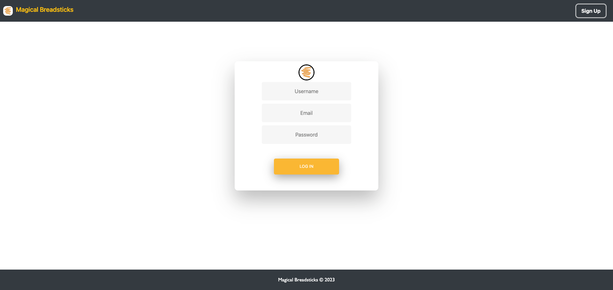

#  Magical Breadsticks

 ## Description
###
 An AI generated Comic book generator with server functionality.  

  

  ## Table of Contents

  * [How to use](#usage)

  * [Links](#links)

  * [Contributors](#contributors)

  
   

  ## How to Use
  ###
  Click the "Sign Up" button at the top right portion of the webpage and create your account by providing a username, email address, and a password.  Once logged in, follow the prompts to create your story and click "submit".  
  
   

  ## Links
  ### 
  <a href= https://github.com/konnyph/magical-breadsticks> Github

  <a href= https://magical-breadsticks.herokuapp.com/ > Heroku

 

  ## Contributors

  * Konny Ho
  * Abigail Henderson
  * Eugene Park
  * Tim Aspesberro
  * Mark Green 

 

 

 
